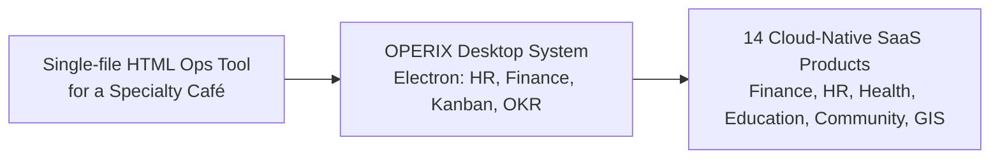
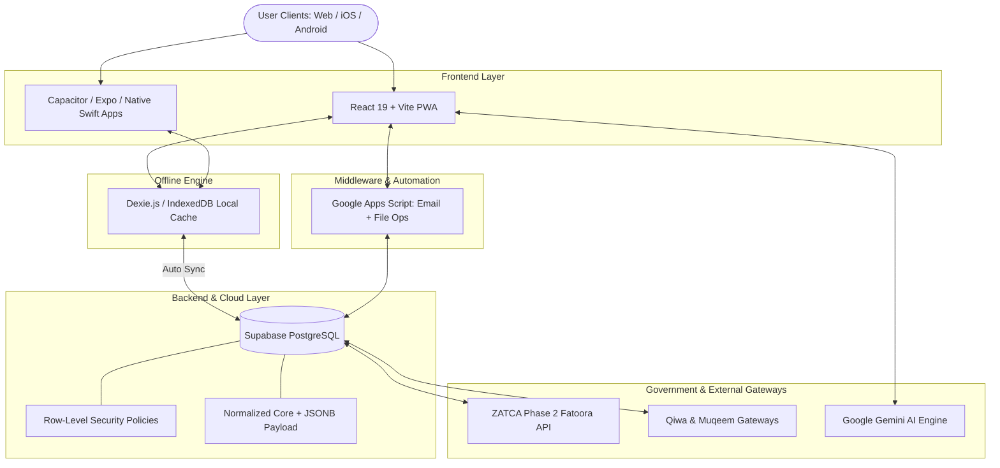

# OPERIX Solutions
### `mindbreakops`

**Enterprise Software Architecture · AI Systems · Mobile Engineering · GIS Platforms**

  

  
  
  
  
  

---

## 🧭 What's Inside

| Section | What you'll find |
|:---|:---|
| 🌐 Enterprise Portal & Network | Corporate site, product domain map, local asset paths |
| 🧠 Our Story | How a single café tool grew into a 14-product suite |
| 🛠️ Technology Stack | Frontend, mobile, backend, middleware, and AI layers |
| 🚀 Production Products Catalog | All 14 live systems, one line each |
| 🔍 In-Depth Product Breakdown | Feature-level detail for every product |
| 🏛️ System Architecture | How data moves between clients, cache, database, and government APIs |
| ⚖️ Regional & Regulatory Alignment | ZATCA, PDPL, Qiwa, Muqeem, WPS, and CCHI at a glance |
| 📊 Activity | GitHub contribution activity |
| 📬 Connect | Where to reach OPERIX Solutions |

---

## 🌐 Enterprise Portal & Product Network

* **Corporate Site:** [operix-solutions.com](https://operix-solutions.com) — a premium dark-blue and gold navbar and footer, with iPhone 17 and MacBook M4 device-frame showcases for every product
* **Product Network Domain:** `*.operix-solutions.online`
* **Local Product Icons Directory:** [`./icons/system/`](./icons/system/)

---

## 🧠 Our Story

OPERIX didn't start as a 14-product enterprise suite. It started as a single-file HTML operations tool built for one specialty café, styled with an early liquid-glass design system and running on a Google Apps Script backend.

That tool was rebuilt on Supabase, then re-imagined as **OPERIX Desktop System** — an Electron app bundling HR, finance, Kanban boards, OKR tracking, and analytics into one internal command center. From there, each module outgrew the container it was born in and split off into its own purpose-built, multi-tenant SaaS product. That's the network you see below today.

---

## 🛠️ Technology Stack & SVG Ecosystem

### Development Ecosystem

  

 

### Frameworks & Native Core

| Vector Logo | Domain | Core Stack | Platform Focus |
|:---:|---|---|---|
|  | **Frontend & Web** | React 19, Vite, Tailwind CSS, Framer Motion, Zustand | Modern Work OS & SaaS Interfaces |
|  | **Mobile & Native** | React Native, Expo, Capacitor Native (iOS/Android), Swift + ActivityKit/WidgetKit | Offline-First Field Ops & Native iOS Experiences |
|  | **Backend & DB** | Supabase, PostgreSQL, Hybrid JSONB, Dexie IndexedDB | Financial Ledger & Multi-Tenant RLS |
|  | **Middleware & Automation** | Google Apps Script (GAS) | Email Delivery, File Operations, Legacy Bridge Integrations |
|  | **AI & Vision** | Google Gemini AI, `face-api.js`, Tesseract OCR, Leaflet | Biometric Attendance & Generative AI |

---

## 🚀 Official OPERIX Production Products Catalog

All enterprise products hosted on **`*.operix-solutions.online`** and **`operix-solutions.com`**:

| Product Icon | Product Name | Category & Badges | Official URL | Link / Status |
|:---:|---|---|---|:---:|
|  | **XYROS OS** | Enterprise Work OS • Odoo-Level Parity • Black UI Theme • Passkeys | [`xyros.operix-solutions.online`](https://xyros.operix-solutions.online) |  |
|  | **OPERIX Operations** | ANPR Gate Automation • Geofenced Attendance • Hardened Auth Flow | [`ops.operix-solutions.online`](https://www.ops.operix-solutions.online) |  |
|  | **OPERIX FMIS** | ZATCA Phase 2 • Retail POS • Double-Entry GL • Bilingual i18n | [`fmis.operix-solutions.online`](https://www.fmis.operix-solutions.online) |  |
|  | **OPERIX HRIS** | Qiwa & Muqeem • WPS Payroll • AI Screening • Device-Trust OTP | [`hris.operix-solutions.online`](https://www.hris.operix-solutions.online) |  |
|  | **OPERIX Health Care** | CCHI Aligned • Longitudinal MRN • ECG-Inspired Design | [`care.operix-solutions.online`](https://www.care.operix-solutions.online) |  |
|  | **OPERIX Edu** | Ministry Standards • PDPL Compliant • Parent Portal • Dox Studio | [`edu.operix-solutions.online`](https://www.edu.operix-solutions.online) |  |
|  | **OPERIX Speciality** | Specialty Café • Roastery Supply Chain • Liquid-Glass POS | [`cafe.operix-solutions.online`](https://cafe.operix-solutions.online) |  |
|  | **Abdullah Bin Abbas** | Qur'an Centre Portal • Native iOS Companion • Digital Certification | [`bin-abbas.operix-solutions.online`](https://www.bin-abbas.operix-solutions.online) |  |
|  | **Hasad Hub** | Smart Community • GIS + Resident Registry • Real Estate Ops | [`hasad.operix-solutions.online`](https://www.hasad.operix-solutions.online/Naseem_City) |  |
|  | **Mamey Platform** | General Trading & Logistics • Supply Chain | [`mamey.vercel.app`](https://mamey.vercel.app) |  |
|  | **OPERIX QA** | Quality Control Audits • Automated Scorecards | [`qa.operix-solutions.online`](https://qa.operix-solutions.online) |  |
|  | **OPERIX Superadmin** | Multi-Tenant Governance • Telemetry Console | [`admin.operix-solutions.online`](https://admin.operix-solutions.online) |  |
|  | **OPERIX Relief GIS** | Crisis Logistics Mapping • Emergency Relief | [`sudan.operix-solutions.online`](https://sudan.operix-solutions.online) |  |
|  | **OPERIX Portal** | Corporate Showcase • Device-Frame Mockups • Premium Navbar | [`operix-solutions.com`](https://operix-solutions.com) |  |

---

## 🔍 In-Depth Product Breakdown

### 1. 🖥️ **XYROS OS — Enterprise Work Operating System**
* **URL:** [`https://xyros.operix-solutions.online`](https://xyros.operix-solutions.online)
* **Icon:** `./icons/system/xyros.svg`
* **Features:** Built around a 4-tier hierarchy (Organizations, Workspaces, Boards, Groups/Items). Supports WebAuthn Passkeys, TOTP 2FA, a global command palette (`Cmd/Ctrl + K`), an embedded AI Copilot (`Cmd/Ctrl + J`), and dynamic Table/Kanban/Calendar views. Designed for feature parity with mature ERP suites like Odoo — including a custom icon system and a modular website builder — but reimagined with a distinctive black-themed interface, multi-tenant architecture, and PostgreSQL row-level security via Supabase.

### 2. 🚚 **OPERIX Operations — Fleet & Workforce Matrix**
* **URL:** [`https://www.ops.operix-solutions.online`](https://www.ops.operix-solutions.online)
* **Icon:** `./icons/system/operations.svg`
* **Features:** ANPR parking and gate automation, geofenced GPS workforce attendance, a C-suite executive command center, an AI communications core for corporate memos, and a mission-specific low-code app builder. Authentication runs a hardened three-step flow (workspace selection → password → time-boxed OTP) with race-condition-safe session handling, so field teams don't get stuck mid-login during shift changes.

### 3. 💰 **OPERIX FMIS — Finance & Retail ERP**
* **URL:** [`https://www.fmis.operix-solutions.online`](https://www.fmis.operix-solutions.online)
* **Icon:** `./icons/system/fmis.svg`
* **Features:** ZATCA Phase 2 e-invoicing compliance (UBL 2.1 XML clearing), a double-entry general ledger, and a retail barcode POS. The retail module spans products, purchase orders, suppliers, and inventory transactions, all fully bilingual, with a Retail Overview dashboard in progress to bring those numbers together in one view.

### 4. 👥 **OPERIX HRIS — Human Capital Infrastructure**
* **URL:** [`https://www.hris.operix-solutions.online`](https://www.hris.operix-solutions.online)
* **Icon:** `./icons/system/hris.svg`
* **Features:** Direct Qiwa & Muqeem government gateway integrations, WPS bank-ready payroll export, and AI CV screening. Login uses device-trust OTP with a persistent trusted-devices table, so recognized phones and laptops skip repeat verification. Staff-facing tools include ten customizable HR document templates with logo branding, plus a mobile PWA employee portal for GPS-geofenced, face-recognition clock-in with built-in payroll calculation.

### 5. 🏥 **OPERIX Health Care — Clinical Management Core**
* **URL:** [`https://www.care.operix-solutions.online`](https://www.care.operix-solutions.online)
* **Icon:** `./icons/system/care.svg`
* **Features:** Longitudinal patient case records (MRN), a triage queue board, voice-to-text clinical dictation, and pharmacy & blood bank formulary tracking, aligned with CCHI practices. The subscription experience is built around a heartbeat/ECG-inspired visual language, with four VAT-inclusive pricing tiers so procurement teams see the full landed cost upfront.

### 6. 🎓 **OPERIX Edu — School Management Platform**
* **URL:** [`https://www.edu.operix-solutions.online`](https://www.edu.operix-solutions.online)
* **Icon:** `./icons/system/edu.png`
* **Features:** Ministry of Education standards compliance, the Dox Studio automated transcript and certificate generator, a student registry, a fees treasury, and a parent progress portal. Terms and data handling are aligned with Saudi PDPL as well as ZATCA, and the bilingual landing experience uses scroll-triggered animation with academic visual motifs throughout.

### 7. ☕ **OPERIX Speciality — Café & Hospitality Operations**
* **URL:** [`https://cafe.operix-solutions.online`](https://cafe.operix-solutions.online)
* **Icon:** `./icons/system/speciality.svg`
* **Features:** Specialty coffee group POS with instant VAT breakdown, roastery green-bean batch yield tracking, multi-branch stock management, and a print-ready menu board designer. This is where OPERIX began — as a single-file HTML ops tool for one café — since rebuilt on Supabase with a liquid-glass interface and generalized into a full POS and supply-chain platform for multi-branch hospitality operators.

### 8. 🕌 **Abdullah Bin Abbas Centre — Portal & Companion App** *(Arabic: مركز عبدالله بن عباس)*
* **URL:** [`https://www.bin-abbas.operix-solutions.online`](https://www.bin-abbas.operix-solutions.online)
* **Icon:** `./icons/system/binabbas.svg`
* **Features:** The admin portal handles Qur'an memorization circle logs, recitation assessment records, digital certificate exports, Excel exports, and professional invoice printing for the physical centre. A companion native iOS app, built in Swift, gives worshippers a Qur'an reader and prayer times, with a full widget, Live Activity, and Dynamic Island system via ActivityKit and WidgetKit, sharing data through a dedicated app group.

### 9. 🏡 **Hasad Hub — Smart Community Platform** *(Arabic: حصاد, "harvest")*
* **URL:** [`https://www.hasad.operix-solutions.online/Naseem_City`](https://www.hasad.operix-solutions.online/Naseem_City)
* **Icon:** `./icons/system/hasad.png`
* **Features:** Real estate property operations, resident maintenance ticketing, facility logs, and automated community billing, alongside committee-governance workflows for HOA-style resident boards. Its live Naseem City deployment adds GIS mapping, a resident registry, and automated certificate generation, hosted via GitHub Pages. The interface pairs Reem Kufi and Tajawal Arabic type with IBM Plex Mono for data, a red-600 accent, and an animated SVG community illustration.

### 10. 📦 **Mamey Platform — General Trading & Logistics**
* **URL:** [`https://mamey.vercel.app`](https://mamey.vercel.app)
* **Icon:** `./icons/system/mamey.png`
* **Features:** A general trading and logistics platform coordinating supply chain operations end to end, from sourcing through distribution.

### 11. 🔍 **OPERIX QA — Quality Control & Audit Console**
* **URL:** [`https://qa.operix-solutions.online`](https://qa.operix-solutions.online)
* **Icon:** `./icons/system/ops-site.svg`
* **Features:** Structured audit workflows with automated scorecards, giving operations teams a consistent way to grade quality across sites and shifts.

### 12. 🛡️ **OPERIX Superadmin — Governance & Telemetry Console**
* **URL:** [`https://admin.operix-solutions.online`](https://admin.operix-solutions.online)
* **Icon:** `./icons/system/operix-os.svg`
* **Features:** The console behind every other OPERIX product — tenant provisioning, cross-product governance, and a live telemetry view into system health across the network.

### 13. 🗺️ **OPERIX Relief GIS — Crisis Logistics Mapping**
* **URL:** [`https://sudan.operix-solutions.online`](https://sudan.operix-solutions.online)
* **Icon:** `./icons/system/operix-sudan.png`
* **Features:** Maps emergency relief logistics across Sudan, built to help coordinate distribution when conventional infrastructure is under strain.

### 14. 🏢 **OPERIX Portal — Corporate Web Site & Solution Showcase**
* **URL:** [`https://operix-solutions.com`](https://operix-solutions.com)
* **Icon:** `./icons/system/brand-mark.svg`
* **Features:** The public front door for OPERIX Solutions, built with a premium dark-blue and gold navbar and footer, plus iPhone 17 and MacBook M4 device-frame mockups that showcase every product in context.

---

## 🏛️ System Architecture Pattern

---

## ⚖️ Regional & Regulatory Alignment

Every OPERIX product is built for the regulatory reality of the markets it serves, not bolted on after the fact.

| Standard | Applies To | What It Covers |
|:---|:---|:---|
| **ZATCA Phase 2** | FMIS | UBL 2.1 XML e-invoice clearing for the Saudi tax authority |
| **Qiwa & Muqeem** | HRIS | Direct government gateway integration for labor and residency records |
| **WPS** | HRIS | Bank-ready Wage Protection System payroll export |
| **PDPL** | Edu | Saudi Personal Data Protection Law aligned data handling |
| **CCHI** | Health Care | Council of Cooperative Health Insurance aligned clinical practice |

---

## 📊 GitHub Profile Activity & Streak

  

  

---

## 📬 Connect with OPERIX Solutions

  
  
  
  

  <b>Designed & Built with ❤️ by OPERIX Solutions (`mindbreakops`)</b>

