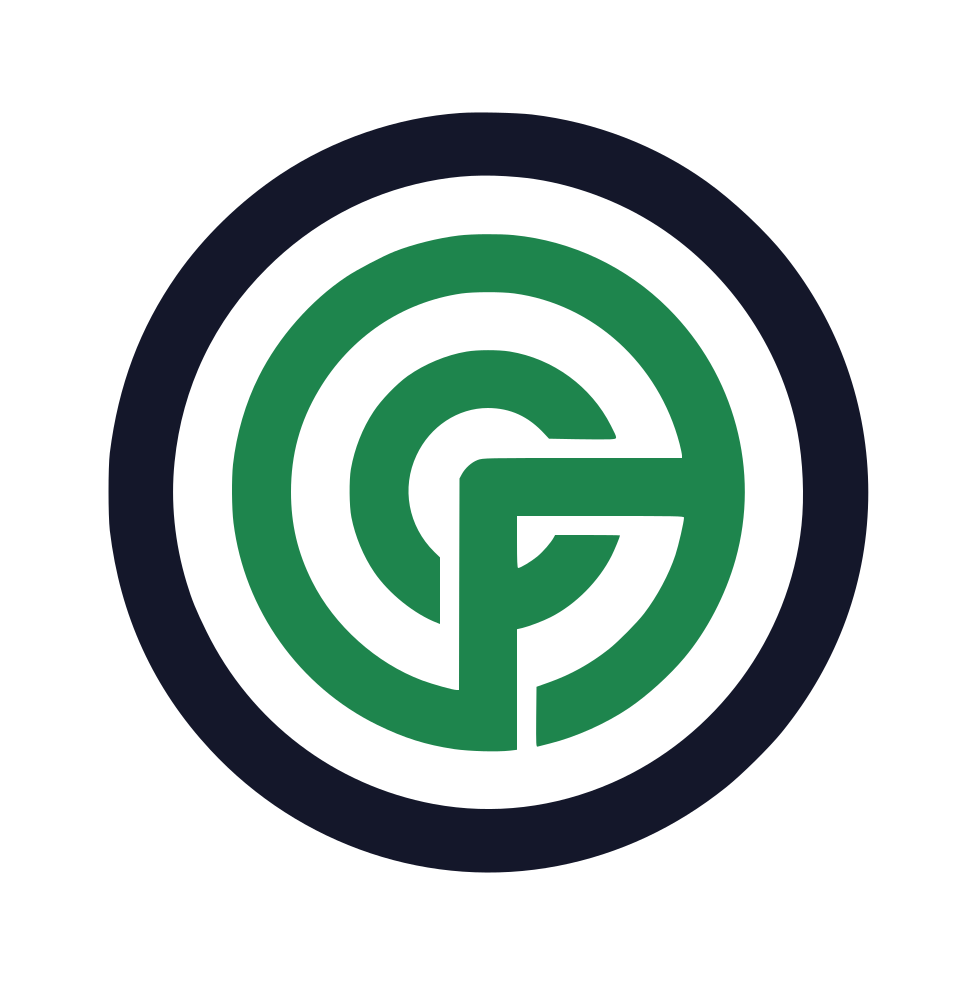
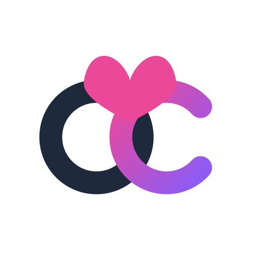
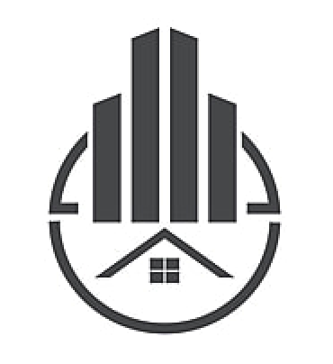
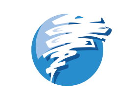
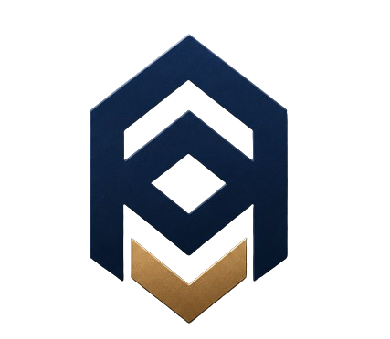
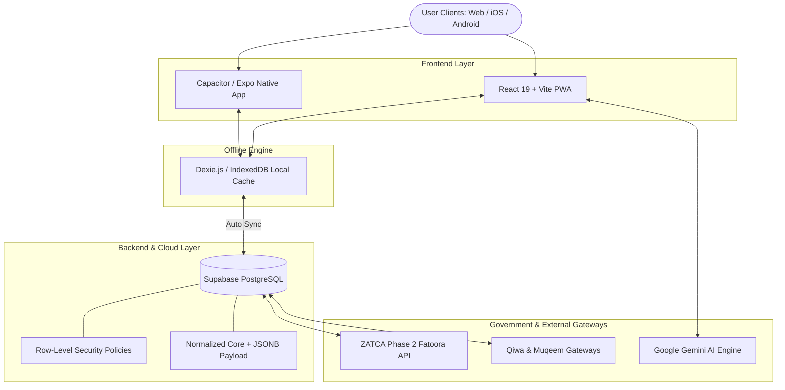

# ⚡ OPERIX Solutions (`mindbreakops`)

### **Enterprise Software Architecture • AI Systems • Mobile Engineering • GIS Platforms**

  

---

  
  
  
  

---

## 🌐 Enterprise Portal & Product Network

* **Corporate Site:** [https://operixsolutions.com](https://operixsolutions.com)
* **Product Network Domain:** `*.operix-solutions.online`
* **Local Icons Directory:** [`./icons/system/`](./icons/system/)

---

## 🛠️ Technology Stack & SVG Ecosystem

### **Development Ecosystem**

  

 

### **Frameworks & Native Core**

| Vector Logo | Domain | Core Stack | Platform Focus |
|:---:|---|---|---|
|  | **Frontend & Web** | React 19, Vite, Tailwind CSS, Framer Motion, Zustand | Modern Work OS & SaaS Interfaces |
|  | **Mobile & Native** | React Native, Expo, Capacitor Native (iOS/Android), PWA | Offline-First & ANPR Field Ops |
|  | **Backend & DB** | Supabase, PostgreSQL, Hybrid JSONB, Dexie IndexedDB | Financial Ledger & Multi-Tenant RLS |
|  | **AI & Vision** | Google Gemini AI, `face-api.js`, Tesseract OCR, Leaflet | Biometric Attendance & Generative AI |

---

## 🚀 Official OPERIX Production Products Catalog

All enterprise products hosted on **`*.operix-solutions.online`** and **`operixsolutions.com`**:

| Official Product SVG | Product Name | Category & Badges | Official URL | Link / Status |
|:---:|---|---|---|:---:|
|  | **XYROS OS** | Enterprise Work OS • 4-Tier Hierarchy • Passkeys | [`xyros.operix-solutions.online`](https://xyros.operix-solutions.online) |  |
|  | **OPERIX Operations** | ANPR Gate Automation • Geofenced Attendance | [`ops.operix-solutions.online`](https://www.ops.operix-solutions.online) |  |
|  | **OPERIX FMIS** | ZATCA Phase 2 • Retail POS • Double-Entry GL | [`fmis.operix-solutions.online`](https://www.fmis.operix-solutions.online) |  |
|  | **OPERIX HRIS** | Qiwa & Muqeem • WPS Payroll • AI Screening | [`hris.operix-solutions.online`](https://www.hris.operix-solutions.online) |  |
|  | **OPERIX Health Care** | CCHI Aligned • Longitudinal MRN • Clinical HIS | [`care.operix-solutions.online`](https://www.care.operix-solutions.online) |  |
|  | **OPERIX Edu** | Ministry Standards • Parent Portal • Dox Studio | [`edu.operix-solutions.online`](https://www.edu.operix-solutions.online) |  |
|  | **OPERIX Speciality** | Specialty Café • Roastery Supply Chain • POS | [`cafe.operix-solutions.online`](https://cafe.operix-solutions.online) |  |
|  | **Abdullah Bin Abbas** | Qur'an Centre Portal • Digital Certification | [`bin-abbas.operix-solutions.online`](https://www.bin-abbas.operix-solutions.online) |  |
|  | **Hasad Hub** | Smart Community • Real Estate Operations | [`hasad.operix-solutions.online`](https://www.hasad.operix-solutions.online/Naseem_City) |  |
|  | **Mamey Platform** | General Trading & Logistics • Supply Chain | [`mamey.vercel.app`](https://mamey.vercel.app) |  |
|  | **OPERIX QA** | Quality Control Audits • Automated Scorecards | [`qa.operix-solutions.online`](https://qa.operix-solutions.online) |  |
|  | **OPERIX Superadmin** | Multi-Tenant Governance • Telemetry Console | [`admin.operix-solutions.online`](https://admin.operix-solutions.online) |  |
|  | **OPERIX Relief GIS** | Crisis Logistics Mapping • Emergency Relief | [`sudan.operix-solutions.online`](https://sudan.operix-solutions.online) |  |
|  | **OPERIX Portal** | Corporate Web Site & Solution Showcase | [`operixsolutions.com`](https://operixsolutions.com) |  |

---

## 🔍 In-Depth Product Breakdown

### 1. 🖥️ **XYROS OS — Enterprise Work Operating System**
* **URL:** [`https://xyros.operix-solutions.online`](https://xyros.operix-solutions.online)
* **SVG Icon:** `./icons/system/xyros.svg`
* **Features:** Built around a 4-tier hierarchy (Organizations, Workspaces, Boards, Groups/Items). Supports WebAuthn Passkeys, TOTP 2FA, global command palette (`Cmd/Ctrl + K`), embedded AI Copilot (`Cmd/Ctrl + J`), and dynamic Table/Kanban/Calendar views.

### 2. 🚚 **OPERIX Operations — Fleet & Workforce Matrix**
* **URL:** [`https://www.ops.operix-solutions.online`](https://www.ops.operix-solutions.online)
* **SVG Icon:** `./icons/system/operations.svg`
* **Features:** ANPR parking & gate automation, geofenced GPS workforce attendance, C-suite executive command center, AI communications core for corporate memos, and mission-specific low-code app builder.

### 3. 💰 **OPERIX FMIS — Finance & Retail ERP**
* **URL:** [`https://www.fmis.operix-solutions.online`](https://www.fmis.operix-solutions.online)
* **SVG Icon:** `./icons/system/fmis.svg`
* **Features:** ZATCA Phase 2 e-invoicing compliance (UBL 2.1 XML clearing), double-entry general ledger, retail barcode POS, SKU stock reorder tracking, and embedded AI financial assistant.

### 4. 👥 **OPERIX HRIS — Human Capital Infrastructure**
* **URL:** [`https://www.hris.operix-solutions.online`](https://www.hris.operix-solutions.online)
* **SVG Icon:** `./icons/system/hris.svg`
* **Features:** Direct Qiwa & Muqeem government gateway integrations, WPS bank-ready payroll export, AI CV screening, GPS geofenced attendance, and native Capacitor mobile app.

### 5. 🏥 **OPERIX Health Care — Clinical Management Core**
* **URL:** [`https://www.care.operix-solutions.online`](https://www.care.operix-solutions.online)
* **SVG Icon:** `./icons/system/care.svg`
* **Features:** Longitudinal patient case records (MRN), triage queue board, voice-to-text clinical dictation, pharmacy & blood bank formulary tracking, and HIPAA/CCHI aligned practices.

### 6. 🎓 **OPERIX Edu — School Management Platform**
* **URL:** [`https://www.edu.operix-solutions.online`](https://www.edu.operix-solutions.online)
* **SVG Icon:** `./icons/system/edu.png`
* **Features:** Ministry of Education standards compliance, Dox Studio automated transcript and certificate generator, student registry, fees treasury, and parent progress portal.

### 7. ☕ **OPERIX Speciality — Café & Hospitality Operations**
* **URL:** [`https://cafe.operix-solutions.online`](https://cafe.operix-solutions.online)
* **SVG Icon:** `./icons/system/speciality.svg`
* **Features:** Specialty coffee group POS with instant VAT breakdown, roastery green bean batch yield tracking, multi-branch stock management, and print-ready menu board designer.

### 8. 🕌 **Abdullah Bin Abbas Centre Portal**
* **URL:** [`https://www.bin-abbas.operix-solutions.online`](https://www.bin-abbas.operix-solutions.online)
* **SVG Icon:** `./icons/system/binabbas.svg`
* **Features:** Qur'an memorization circle logs, recitation assessment records, digital certification exports, and community event scheduling.

### 9. 🏡 **Hasad Hub — Smart Community Platform**
* **URL:** [`https://www.hasad.operix-solutions.online/Naseem_City`](https://www.hasad.operix-solutions.online/Naseem_City)
* **SVG Icon:** `./icons/system/hasad.png`
* **Features:** Real estate property operations, resident maintenance ticketing thread, facility logs, and automated community billing statements.

---

## 🏛️ System Architecture Pattern

---

## 📊 GitHub Profile Statistics

  
  

  

---

## 📬 Connect with OPERIX Solutions

  
  
  
  

  <b>Designed & Built with ❤️ by OPERIX Solutions (`mindbreakops`)</b>

